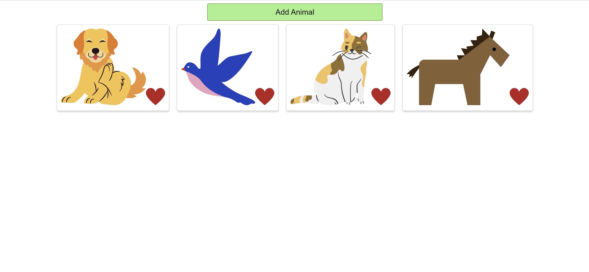

# React love animals project.

click [HERE](https://animals-application.vercel.app/) to checkout this project

## A small scaled React project.

### Summary
This small project was used to introduce beginning developers to using click events, functions, array destructuring and useState (hooks) to change user interaction when using an application. 

### Author: Calvin Anthony Lee | Software Developer 
[Github](https://github.com/calvinalee2006) |  [LinkedIn](https://www.linkedin.com/in/calvinalee/) | [Website](https://calvins-react-portfolio.vercel.app/)